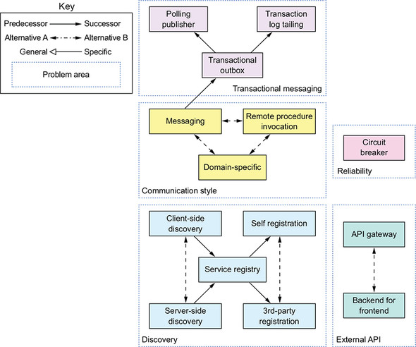

# MicroservicePattern

## 1. Escaping monolithic hell

### The benefits of the monolithic architecture

* Simple to develop— IDEs and other developer tools are focused on building a single application.
* Easy to make radical changes to the application— You can change the code and the database schema, build, and deploy.
* Straightforward to test— The developers wrote end-to-end tests that launched the application, invoked the REST API, and tested the UI with Selenium.
* Straightforward to deploy— All a developer had to do was copy the WAR file to a server that had Tomcat installed.
* Easy to scale— FTGO ran multiple instances of the application behind a load balancer.

### WHAT YOU’LL LEARN IN THIS BOOK

* The essential characteristics of the microservice architecture, its benefits and drawbacks, and when to use it
* Distributed data management patterns
* Effective microservice testing strategies
* Deployment options for microservices
* Strategies for refactoring a monolithic application into a microservice architecture

### Scale cube and microservices

The model defines three ways to scale an application: X, Y, and Z.

**X-axis scaling load balances requests across multiple instances**

X-axis scaling is a common way to scale a monolithic application. 

Z-axis scaling also runs multiple instances of the monolith application, but unlike X-axis scaling, each instance is responsible for only a subset of the data.

Each application instance is responsible for a subset of users. The router uses the userId specified by the request Authorization header to select one of the N identical instances of the application. **Z-axis scaling is a great way to scale an application to handle increasing transaction and data volumes.**

X- and Z-axis scaling improve the application’s capacity and availability. But neither approach solves the problem of increasing development and application complexity. To solve those, you need to apply Y-axis scaling, or functional decomposition.

### Each service has its own database

A key characteristic of the microservice architecture is that the services are loosely coupled and communicate only via APIs. One way to achieve loose coupling is by each service having its own datastore.

### Benefits of the microservice architecture

The microservice architecture has the following benefits:

* It enables the continuous delivery and deployment of large, complex applications.
* Services are small and easily maintained.
* Services are independently deployable.
* Services are independently scalable.
* The microservice architecture enables teams to be autonomous.
* It allows easy experimenting and adoption of new technologies.
* It has better fault isolation.

### Drawbacks of the microservice architecture

* Finding the right set of services is challenging.
* Distributed systems are complex, which makes development, testing, and deployment difficult.
* Deploying features that span multiple services requires careful coordination.
* Deciding when to adopt the microservice architecture is difficult.

Figure 1.12 shows the communication patterns, which are organized into five groups:

* Communication style— What kind of IPC mechanism should you use?
* Discovery— How does a client of a service determine the IP address of a service instance so that, for example, it makes an HTTP request?
* Reliability— How can you ensure that communication between services is reliable even though services can be unavailable?
* Transactional messaging— How should you integrate the sending of messages and publishing of events with database transactions that update business data?
* External API— How do clients of your application communicate with the services?

### Data consistency patterns for implementing transaction management

Because each service has its own database, you must use the Saga pattern to maintain data consistency across services.

### Patterns for querying data in a microservice architecture

Because each service has its own database, you must use one of the querying patterns to retrieve data scattered across multiple services.

### Service deployment patterns

Several patterns for deploying microservices. The traditional approach is to deploy services in a language-specific packaging format. There are two modern approaches to deploying services. The first deploys services as VM or containers. The second is the serverless approach. You simply upload the service’s code and the serverless platform runs it. You should use a service deployment platform, which is an automated, self-service platform for deploying and managing services.

### Observability patterns provide insight into application behavior

You can use the following patterns to design observable services:

* Health check API— Expose an endpoint that returns the health of the service.
* Log aggregation— Log service activity and write logs into a centralized logging server, which provides searching and alerting.
* Distributed tracing— Assign each external request a unique ID and trace requests as they flow between services.
* Exception tracking— Report exceptions to an exception tracking service, which deduplicates exceptions, alerts developers, and tracks the resolution of each exception.
* Application metrics— Maintain metrics, such as counters and gauges, and expose them to a metrics server.
* Audit logging— Log user actions.

### Patterns for the automated testing of services

* Consumer-driven contract test— Verify that a service meets the expectations of its clients.
* Consumer-side contract test— Verify that the client of a service can communicate with the service.
* Service component test— Test a service in isolation.

### Security patterns

A common solution is to apply the Access token pattern. The API gateway passes an access token, such as JWT (JSON Web Token), to the services, which can validate the token and obtain information about the user. Chapter 11 discusses the Access token pattern in more detail.

### Software development and delivery process

Using the microservice architecture with a waterfall development process is like driving a horse-drawn Ferrari—you squander most of the benefit of using microservices. If you want to develop an application with the microservice architecture, it’s essential that you adopt agile development and deployment practices such as Scrum or Kanban. Better yet, you should practice continuous delivery/deployment, which is a part of DevOps.

* Deployment frequency— How often software is deployed into production
* Lead time— Time from a developer checking in a change to that change being deployed
* Mean time to recover— Time to recover from a production problem
* Change failure rate— Percentage of changes that result in a production problem

### SUMMARY

* The Monolithic architecture pattern structures the application as a single deployable unit.
* The Microservice architecture pattern decomposes a system into a set of independently deployable services, each with its own database.
The monolithic architecture is a good choice for simple applications, but microservice architecture is usually a better choice for large, complex applications.
* The microservice architecture accelerates the velocity of software development by enabling small, autonomous teams to work in parallel.
The microservice architecture isn’t a silver bullet—there are significant drawbacks, including complexity.
* The Microservice architecture pattern language is a collection of patterns that help you architect an application using the microservice architecture. It helps you decide whether to use the microservice architecture, and if you pick the microservice architecture, the pattern language helps you apply it effectively.
* You need more than just the microservice architecture to accelerate software delivery. Successful software development also requires DevOps and small, autonomous teams.
* Don’t forget about the human side of adopting microservices. You need to consider employees’ emotions in order to successfully transition to a microservice architecture.